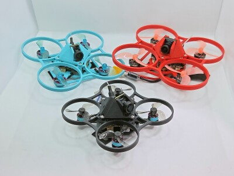
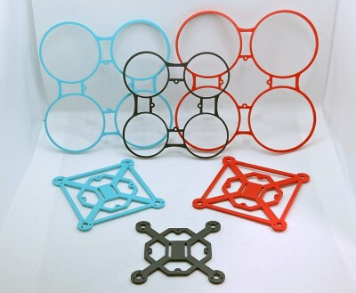
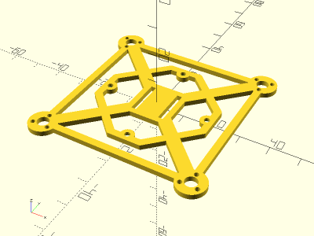
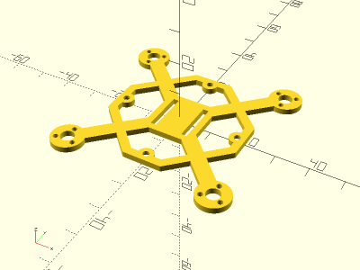
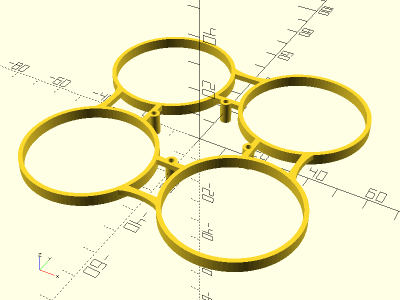
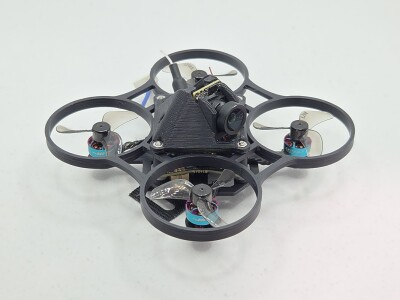
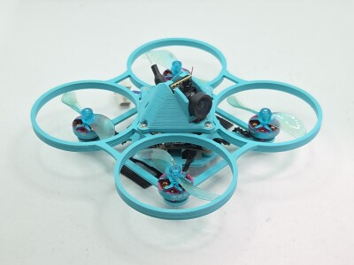
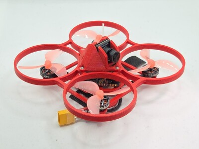

# Parametric Toothpick Frame

<table>
<tr>
<td></td>
<td></td>
</tr>
<tr>
<td></td>
<td></td>
</tr>
<tr>
<td></td>
<td></td>
</tr>
</table>

A parametric micro toothpick frame with optional prop guards. Compatible with canopies from the [Parametric Whoop Canopy](https://github.com/vsergeev/3d-parametric-whoop-canopy) project. Battery is secured to frame with velcro strap. Made with OpenSCAD.

This frame improves on the durability and printability of the [Parametric Whoop](https://github.com/vsergeev/3d-parametric-whoop) project. It has less structural features on the Z-axis, like motor struts or the battery cage, which were prone to breaking on impact. It also prints flat, with no supports, in under one hour.

**Base Designs**

* [`toothpick.scad`](toothpick.scad) - Toothpick Frame
* [`prop_guards.scad`](prop_guards.scad) - Prop Guards

**Instances**

* [`65mm_26x26_toothpick.scad`](65mm_26x26_toothpick.scad) - 65mm Toothpick Frame with 26mm mounting holes (weight 1.9g ASA)
* [`75mm_26x26_toothpick.scad`](75mm_26x26_toothpick.scad) - 75mm Toothpick Frame with 26mm mounting holes (weight 2.9g ASA)
* [`80mm_26x26_toothpick.scad`](80mm_26x26_toothpick.scad) - 80mm Toothpick Frame with 26mm mounting holes (weight 3.5g ASA)
* [`65mm_26x26_prop_guards.scad`](65mm_26x26_prop_guards.scad) - 65mm Prop Guards with 26mm mounting holes (weight 2.7g ASA)
* [`75mm_26x26_prop_guards.scad`](75mm_26x26_prop_guards.scad) - 75mm Prop Guards with 26mm mounting holes (weight 3.8g ASA)
* [`80mm_26x26_prop_guards.scad`](80mm_26x26_prop_guards.scad) - 80mm Prop Guards with 26mm mounting holes (weight 5.4g ASA)

**Recommended Print Settings:** ASA / PETG for frame, ASA / PETG / Hard TPU for prop guards, 0.20mm layer height, 100% infill, no supports. Print frame and prop guards upside down.

**Printables:** https://www.printables.com/model/1551047-parametric-toothpick-frame

**Thingiverse:** https://www.thingiverse.com/thing:7267710

## Builds

### 65mm BETAFPV Matrix 1S 5in1 (Analog VTX) + BETAFPV C03 Camera

* Frame: [65mm_26x26_toothpick.stl](stl/65mm_26x26_toothpick.stl)
* Prop Guards: [65mm_26x26_prop_guards.stl](stl/65mm_26x26_prop_guards.stl)
* Canopy: [betafpv_c03_26x26_canopy.5deg.stl](https://github.com/vsergeev/3d-parametric-whoop-canopy/blob/master/stl/betafpv_c03_26x26_canopy.5deg.stl)
* Flight Controller: [BETAFPV Matrix 1S](https://betafpv.com/collections/brushless-flight-controller/products/matrix-1s-brushless-flight-controller)
* Camera: [BETAFPV C03 Camera](https://betafpv.com/products/c03-fpv-micro-camera)
* Motors: RCinPower 0702 27000KV
* Props: Gemfan 1210-2 31mm
* Hardware:
    * 12x M1.4x3 for motors (included with motors)
    * 4x 2mm tall spacers: [4x2mm_spacer.stl](stl/4x2mm_spacer.stl)
    * 4x M1.6 nuts and 4x M1.6x16 bolts for frame

Total Weight without battery: 23.9g ASA

### 75mm BETAFPV Matrix 1S 5in1 (Analog VTX) + BETAFPV C03 Camera

* Frame: [75mm_26x26_toothpick.stl](stl/75mm_26x26_toothpick.stl)
* Prop Guards: [75mm_26x26_prop_guards.stl](stl/75mm_26x26_prop_guards.stl)
* Canopy: [betafpv_c03_26x26_canopy.5deg.stl](https://github.com/vsergeev/3d-parametric-whoop-canopy/blob/master/stl/betafpv_c03_26x26_canopy.5deg.stl)
* Flight Controller: [BETAFPV Matrix 1S](https://betafpv.com/collections/brushless-flight-controller/products/matrix-1s-brushless-flight-controller)
* Camera: [BETAFPV C03 Camera](https://betafpv.com/products/c03-fpv-micro-camera)
* Motors: RCinPower GTS V3 1002 19000KV
* Props: Gemfan 1610-2 40mm
* Hardware:
    * 12x M1.4x3 for motors (included with motors)
    * 4x 2mm tall spacers: [4x2mm_spacer.stl](stl/4x2mm_spacer.stl)
    * 4x M1.6 nuts and 4x M1.6x16 bolts for frame

Total Weight without battery: 30.2g ASA

### 80mm HDZero AIO15 (Digital VTX) + HDZero Lux Camera

* Frame: [80mm_26x26_toothpick.stl](stl/80mm_26x26_toothpick.stl)
* Prop Guards: [80mm_26x26_prop_guards.stl](stl/80mm_26x26_prop_guards.stl)
* Canopy: [hdzero_lux_26x26_canopy.5deg.stl](https://github.com/vsergeev/3d-parametric-whoop-canopy/blob/master/stl/hdzero_lux_26x26_canopy.5deg.stl)
* Flight Controller: [HDZero AIO15](https://www.hd-zero.com/product-page/hdzero-aio15)
* Camera: [HDZero Lux Camera](https://www.hd-zero.com/product-page/hdzero-lux-camera)
* Motors: Happymodel RS1102 13500KV
* Props: Gemfan 45mm-3
* Hardware:
    * 12x M1.4x4 for motors (included with motors)
    * 4x M1.6 nuts and 4x M1.6x18 bolts for frame

Total Weight without battery: 40.3g ASA

## License

